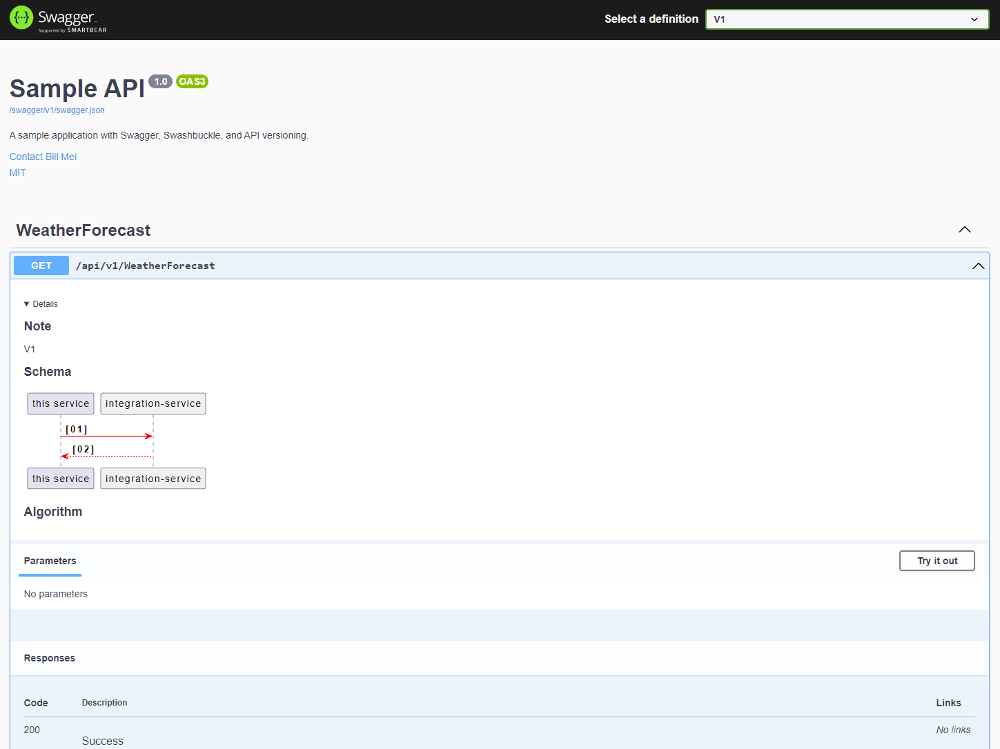

# Swagger.Documentation
The library allows you to embed and render documentation from Markdown files

[](https://travis-ci.com/ZEXSM/Swagger.Documentation)
[](https://coveralls.io/github/ZEXSM/Swagger.Documentation?branch=master)
[](https://www.nuget.org/packages/Swagger.Documentation)

## Benefits
Display documentation from Markdown files



## Installation
To install `Swagger.Documentation` from `Visual Studio`, find `Swagger.Documentation` in the `NuGet` package manager user interface or enter the following command in the package manager console:
```
Install-Package Swagger.Documentation
```

To add a link to the main dotnet project, run the following command line:
```
dotnet add package Swagger.Documentation
```

## Usage
1.  Add support and download Markdown file
    ```csharp
    public void ConfigureServices(IServiceCollection services)
    {
        ...
        services.AddSwaggerGen(options =>
        {
            ...
            options.OperationFilter<WriteMarkdownToDescriptionOperationFilter>();
            ...
        });
        ...
    }
    public void Configure(IApplicationBuilder app, IWebHostEnvironment env)
    {
        ...
        app.UseSwaggerUISupportMarkdown();
        ...
    }
    ```
2. To display documentation in Swagger, you must use one of the structures
    1. Documentation structure for a service without versioning
      * **/ApiDocs** (*reserved directory name*)
        * **/Resource name** (without the word `Controller`)
          * **/Diagrams** (*reserved directory name*. Diagrams related to any of the resource operations/methods)
          * **/Name of the operation** (if absent, the method name is used)
        * **Diagrams** (Optional diagrams reflecting the overall process. Here you can also place diagrams that will be displayed in `README.md`)
        * **Other directories** 

    2. Documentation structure for a versioned service
      * **/ApiDocs** (*reserved directory name*)
        * **/Resource name** (without the word `Controller`)
          * **/Version** (The name must be specified based on the format of the version. Usually it is `V1`)
            * **/Diagrams** (*reserved directory name*. Diagrams related to any of the resource operations/methods)
            * **/Name of the operation** (if absent, the method name is used)
        * **Diagrams** (Optional diagrams reflecting the overall process. Here you can also place diagrams that will be displayed in `README.md`)
        * **Other directories**
